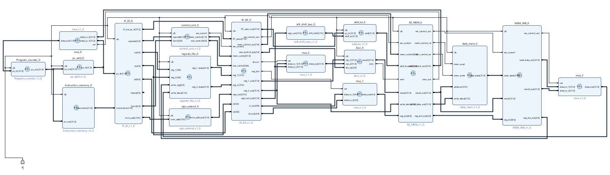
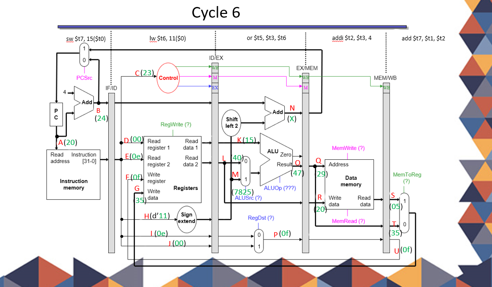

# 32_bit_MIPS_Pipeline_Datapath_Simulation
The main aim of the project is to understand how the process of converting assembly language into machine code represented in hex takes place and then execution of the machine code in the pipelined data path occurs. 

Given below is the Instruction format for MIPS processor.

```
MIPS instruction R - type
________________ _______________________________________________________________________
|    OPCODE     |  RS     |    RT    |       RD      |    SHIFT      |      FUNCTION    |
|_______________|_SOURCE1_|__SOURCE2_|__Destination__|_______________|__________________|
|     6-bit     |   5 bit |   5 bit  |      5bit     |     5 bit     |        6 bit     |
|_______________|_________|__________|_______________|_______________|__________________|
------Function---
ADD    (0x20)
SUB    (0x1A)
MUL    (0x18)
DIV    (0x22)

MIPS instruction I -type 
________________ _______________________________________________________________________
|    OPCODE     |  RS     |    RT        |        Offset address                        |
|_______________|_SOURCE1_|_Destination__|______________________________________________|
|     6-bit     |   5 bit |   5 bit      |          16 bit                              |
|_______________|_________|______________|______________________________________________|
LW - load word
LA - load address
LI - load Immidiate
SW - store word
ADDI - add immidiate  

```
The processor I designed uses Little Endian. Every stage uses one clock cycle for execution. Currently it supports only R type and I type instructions. In I type, provision for branch instructions has also been made but not used for simulation. The RTL block design for MIPS data path is as follows.



To simulate the design, we will be using few instructions which will be stored in instruction memory in HEX format. 
```
lw $t4, 3($0)       0x8c0c0003
add $t7, $t1, $t2   0x012a7820
addi $t2, $t3, 4    0x216a0004
or $t5, $t3, $t6    0x012e7825
lw $t6, 11($0)      0x8c0e000b
sw $t7, 15($0)      0xac0f000f

```
To make the simulation easier to understand, below are the diagrams showing the data paths for every cycle in the pipeline. The simulation report can be accessed in the simulation_src folder of the project.

### Simulation of MIPS data path





